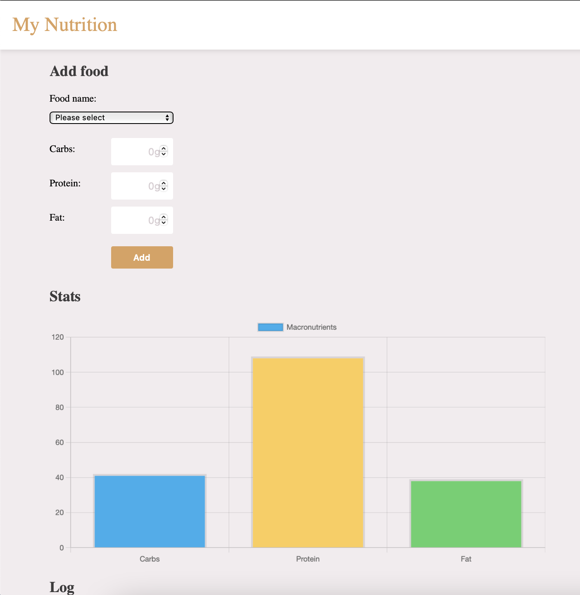
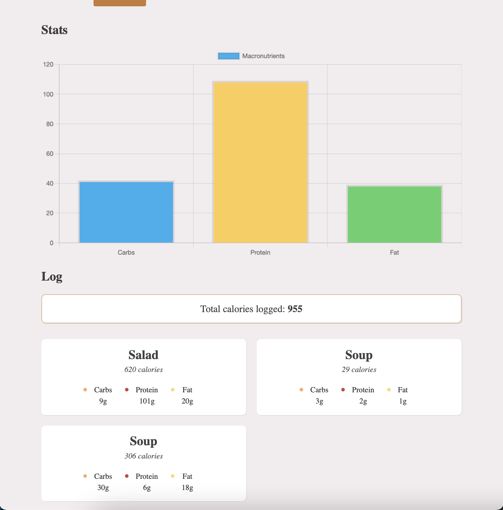

# Food tracker

This is the final project of [learnjavascript.online](https://learnjavascript.online) .

<p> &nbsp;</p>

## Description
This is a web application which tracks the nutritional values of your food. The Data is stored in a database (Firestore). To use this project, check the instruction below.

<p> &nbsp;</p>

## What the Project teached me

* Fetch API
* Modules & importing packages
* Package managers (Parcel)
* Data Structures & their methods
* Iterations and reduce
* Optional chaining & nullish coalescing
* DOM
* Closures
* think about refactoring and DRY

<p> &nbsp;</p>

## Pictures



<p> &nbsp;</p>

**Important: If you'd like to host this project online, please make sure to replace the Base URL of the Firebase API with your own. For that, you need to create a free Firebase account, a new app, and then click on Firestore database.**

<p> &nbsp;</p>

## Setup
We need two libraries:
* [snackbar](https://www.npmjs.com/package/snackbar)
* [ChartJS](https://www.chartjs.org/docs/2.9.4/)

**First time**

```bash
npm init -y
npm install -g parcel-bundler #if parcel is not installed
```

**Then you can run the server**

```bash
npx parcel src/index.html
```

Browse to [localhost:1234](http://localhost:1234)


### Build for production

When you're ready to deploy, you can build for production with the following command:

```bash
npx parcel build src/index.html --no-source-maps --public-url . --no-cache
```
